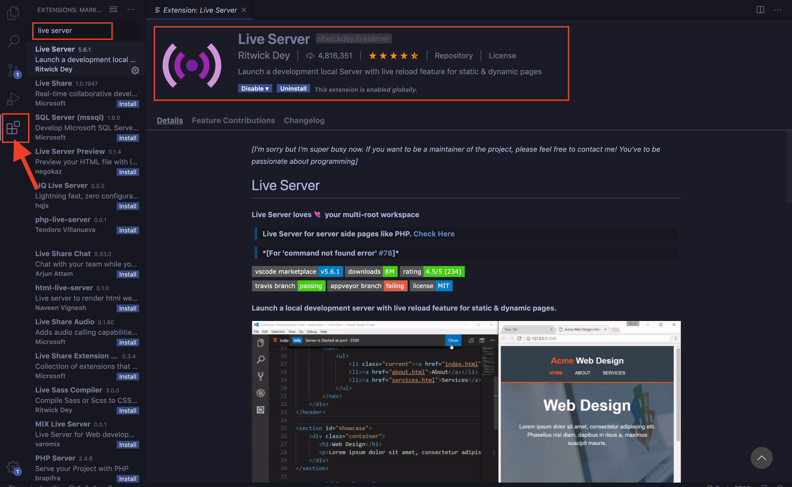

# Setup Visual Studio Code

## Download the ide [VSCODE](https://code.visualstudio.com/download)
## Install the extension Live Server by Ritwick Dey
This makes it super easy to see your application on your browser.

 

## Create a folder named Interactive_Map_With_HERE
- In VSCODE click on File > Open.. 
- Open the folder Interactive_Map_With_HERE
- Click on File > New File and save it as 'index.html' within the folder

 

